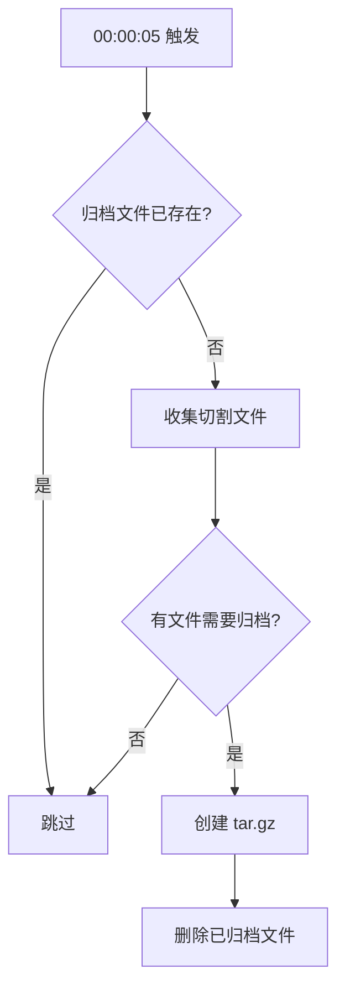

import { TypeTable } from '@/components/type-table';

# 日志切割

`RotatingWriter` 是支持自动切割的日志写入器，实现 `io.Writer` 接口，当文件大小超过阈值时自动切割，并在每天凌晨自动归档前一天的日志。

## RotatingWriter

```go title="rotator.go"
type RotatingWriter struct {
    mu          sync.Mutex
    file        *os.File   // 当前写入的文件
    dir         string     // 日志目录
    baseName    string     // 基础文件名
    ext         string     // 扩展名
    maxSize     int64      // 最大文件大小
    currentSize int64      // 当前文件大小
    currentDate string     // 当前日期
}
```

## RotatorConfig

```go title="rotator.go"
// [!code highlight:6]
type RotatorConfig struct {
    Dir      string // 日志目录
    BaseName string // 基础文件名 (如 "log")
    Ext      string // 扩展名 (如 ".log")
    MaxSize  int64  // 最大文件大小 (字节)，默认 10MB
}
```

### 配置说明

<TypeTable
  type={{
    Dir: {
      description: '日志文件存放目录',
      type: 'string',
      default: '".logs"',
    },
    BaseName: {
      description: '日志文件基础名称',
      type: 'string',
      default: '"log"',
    },
    Ext: {
      description: '日志文件扩展名',
      type: 'string',
      default: '".log"',
    },
    MaxSize: {
      description: '单个日志文件最大大小（字节）',
      type: 'int64',
      default: '10MB',
    },
  }}
/>

## NewRotatingWriter

创建日志切割写入器：

```go title="rotator.go"
// [!code highlight]
func NewRotatingWriter(config RotatorConfig) (*RotatingWriter, error)
```

**示例：**

```go
// [!code highlight:6]
rotator, err := xLog.NewRotatingWriter(xLog.RotatorConfig{
    Dir:      ".logs",
    BaseName: "log",
    Ext:      ".log",
    MaxSize:  10 * 1024 * 1024, // 10MB
})
if err != nil {
    panic(err)
}
```

## 文件命名规则

### 当前日志文件

```
.logs/log.log          # 当前正在写入的文件
```

### 切割后的文件

```
.logs/log.0.log        # 最早的切割文件
.logs/log.1.log        # 较新的切割文件
.logs/log.2.log        # 最新的切割文件
```

**规则：** 索引数字越大，文件越新。

### 归档文件

```
.logs/logger-2024-01-14.tar.gz   # 2024-01-14 的归档
.logs/logger-2024-01-15.tar.gz   # 2024-01-15 的归档
```

## 切割流程

<Mermaid chart="
flowchart TD
    A[写入数据] --> B{当前大小 + 数据 > MaxSize?}
    B -->|否| C[直接写入]
    B -->|是| D[执行切割]
    D --> E[关闭当前文件]
    E --> F[重命名: log.log → log.N.log]
    F --> G[创建新的 log.log]
    G --> C
"/>

**切割逻辑：**

```go title="rotator.go"
func (w *RotatingWriter) rotate() error {
    // [!code highlight:2]
    // 1. 关闭当前文件
    w.file.Close()

    // [!code highlight:2]
    // 2. 查找最大索引
    maxIndex := w.findMaxRotatedIndex()
    nextIndex := maxIndex + 1

    // [!code highlight:2]
    // 3. 重命名当前文件
    os.Rename(w.currentFilePath(), w.rotatedFilePath(nextIndex))

    // [!code highlight:2]
    // 4. 创建新文件
    w.currentSize = 0
    return w.openFile()
}
```

## 归档流程

每天 00:00:05 自动执行归档：



**归档逻辑：**

```go title="rotator.go"
func (w *RotatingWriter) archiveYesterday() {
    // [!code highlight:2]
    // 归档文件名: logger-yyyy-MM-dd.tar.gz
    yesterday := time.Now().AddDate(0, 0, -1).Format("2006-01-02")
    archiveName := fmt.Sprintf("logger-%s.tar.gz", yesterday)

    // [!code highlight:2]
    // 收集需要归档的文件 (log.0.log, log.1.log, ...)
    files := w.collectFilesToArchive()

    // [!code highlight:2]
    // 创建 tar.gz 归档
    w.createTarGz(archivePath, files)

    // [!code highlight:2]
    // 删除已归档的文件
    for _, file := range files {
        os.Remove(file)
    }
}
```

## 目录结构示例

```
.logs/
├── log.log                      # 当前日志文件
├── log.0.log                    # 切割文件 (今天)
├── log.1.log                    # 切割文件 (今天)
├── logger-2024-01-13.tar.gz     # 归档 (前天)
└── logger-2024-01-14.tar.gz     # 归档 (昨天)
```

## 使用示例

### 基础使用

```go
// [!code highlight:5]
rotator, err := xLog.NewRotatingWriter(xLog.RotatorConfig{
    Dir:      ".logs",
    BaseName: "app",
    MaxSize:  5 * 1024 * 1024, // 5MB
})
if err != nil {
    panic(err)
}
defer rotator.Close()

// [!code highlight:2]
// 配合 LogHandler 使用
handler := xLog.NewLogHandler(xLog.HandlerConfig{
    Console: os.Stdout,
    File:    rotator,
    Level:   slog.LevelInfo,
})
```

### 自定义配置

```go
// [!code highlight:7]
// 大型应用：更大的文件和更频繁的切割
rotator, _ := xLog.NewRotatingWriter(xLog.RotatorConfig{
    Dir:      "/var/log/myapp",
    BaseName: "service",
    Ext:      ".json",
    MaxSize:  50 * 1024 * 1024, // 50MB
})
```

```go
// [!code highlight:7]
// 小型应用：较小的文件
rotator, _ := xLog.NewRotatingWriter(xLog.RotatorConfig{
    Dir:      ".logs",
    BaseName: "debug",
    Ext:      ".log",
    MaxSize:  1 * 1024 * 1024, // 1MB
})
```

## 线程安全

`RotatingWriter` 使用 `sync.Mutex` 保证线程安全：

```go title="rotator.go"
func (w *RotatingWriter) Write(p []byte) (n int, err error) {
    // [!code highlight:2]
    w.mu.Lock()
    defer w.mu.Unlock()

    // 检查是否需要切割
    if w.currentSize+int64(len(p)) > w.maxSize {
        w.rotate()
    }

    // 写入数据
    n, err = w.file.Write(p)
    w.currentSize += int64(n)
    return n, err
}
```

## 下一步

<Cards>
  <Card title="自定义 Handler" href="./handler" />
  <Card title="GORM 集成" href="./gorm" />
</Cards>
